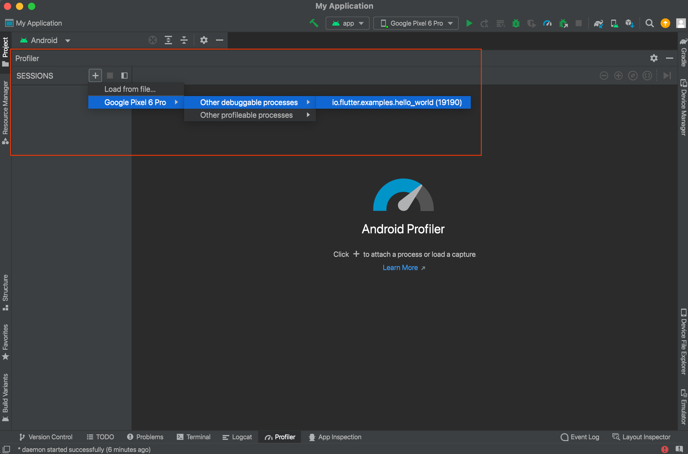

# Android CPU Profiling

Android devices have different performance characteristics than iOS devices, CPU traces frequently reveal surprising performance issues, such as https://github.com/flutter/engine/pull/48303 . This document describes the steps to capture an equivalent [flame graph](https://cacm.acm.org/magazines/2016/6/202665-the-flame-graph/abstract) on your local Android device.

1. Build Local Engine with Symbols

Add the `--no-stripped` flag to the gn config when building the android engine.

Example config:

 `gn --no-lto --runtime-mode=profile --android --android-cpu=arm64 --no-stripped`

2. Configure Gradle to not remove strip sources

In the flutter project file `android/app/build.gradle` , add the following line under the `android` block:

```
    packagingOptions{
        doNotStrip "**/*.so"
    }
```

3. `flutter run` the app with the local engine flags (`--local-engine`,  `--local-engine-host`,  `--local-engine-src-path`).
4. Open Android Studio.

You can create a new blank project if you don't have one already. You do not need to open the application project nor do you need to run the App through Android Studio. In fact, it's much easier if you do not do those things.

5. Open the Profiler Tab

Note: this may be in a different location depending on the exact version of Android Studio that you have installed.


6. Start a New Session.

Click the plus button to start a new session, then look for the attached devices, then finally the name of the application to profile. It usually takes a few seconds for the drop downs to populate. The IDE will warn about the build not being a release build, but this doesn't impact the C++ engine so ignore it.



7. Take a CPU Profile

Click on the CPU section of the chart highlighted below. This will open a side panel that allows you to select the type of profile. Choose "Callstack Sample Recording" and then hit "Record" to start the profile and "Stop" to end the profile


8. Analyze Raster performance

Samples will be collected from all threads, but for analyzing the engine performance we really only care about the raster thread. Note that if you are benchmarking an application that uses platform views, _and_ that platform view uses Hybrid Composition, then the raster thread will be merged with the platform thread.

Select the raster thread by clicking on that area and then choose flame graph (or any of the other options). The flame graph can be navigated using `WASD` and the chart area expanded to make inspection easier.


